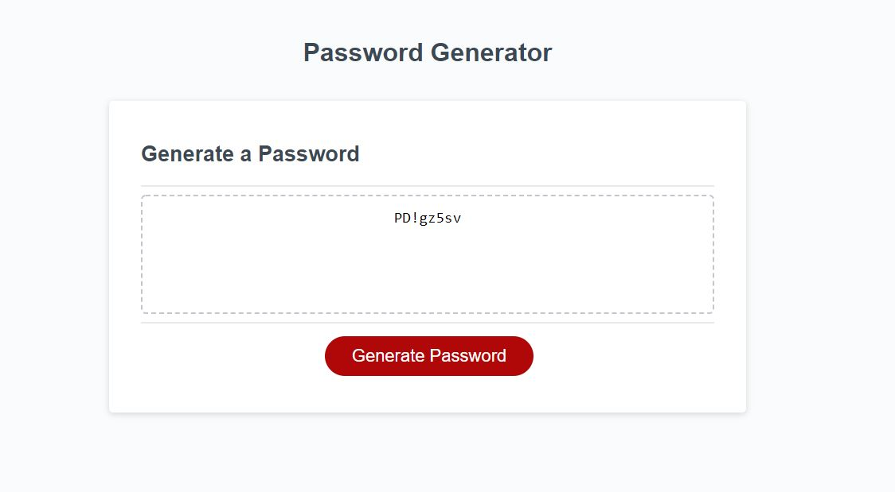

# osu-hw-3
Homework three was a task to great a web based password generator. 
The generator excepts a user input for character length between 8-128
The generator then prompts the user to confirm if they want lower case / upper case / numerical values and/or speical characters
After the user has fulfilled the required prompts, a password is generated on the webpage. 

Link to deployed application
https://rutter10.github.io/osu-hw-3/

Screen shot of application

